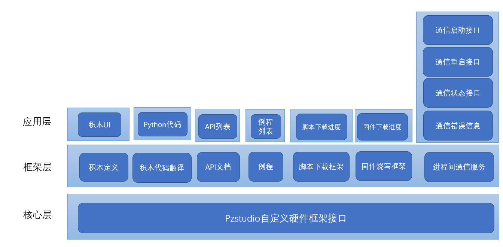

# pzstudio

#### 介绍
开源大师兄pzstudio青少年编程框架

#### 软件架构
PZStudio架构图

#### 安装教程

1.  在下方相关链接中下载PZstudio程序安装包
2.  下载本项目到PC端并解压
3.  安装完成后选择帮助->加载自定义组件->选择上一步解压出来的文件中的dsx.json配置文件，即可将大师兄组件加载到PZstudio中

#### 使用说明

1.  开源组件包含了大师兄开发板的API文档、例程、图形化编程、脚本下载、固件烧写功能，按上述方法安装后即将所有功能加载到PZstudio中
2.  xxxx
3.  xxxx

#### 参与贡献

1.  Fork 本仓库
2.  新建 Feat_xxx 分支
3.  提交代码
4.  新建 Pull Request

#### 相关链接
1.  PZstudio下载链接 [http://www.polygonzone.com/PZStudioInstaller.zip](http://www.polygonzone.com/PZStudioInstaller.zip)
1.  使用 Readme\_XXX.md 来支持不同的语言，例如 Readme\_en.md, Readme\_zh.md
2.  Gitee 官方博客 [blog.gitee.com](https://blog.gitee.com)
3.  你可以 [https://gitee.com/explore](https://gitee.com/explore) 这个地址来了解 Gitee 上的优秀开源项目
4.  [GVP](https://gitee.com/gvp) 全称是 Gitee 最有价值开源项目，是综合评定出的优秀开源项目
5.  Gitee 官方提供的使用手册 [https://gitee.com/help](https://gitee.com/help)
6.  Gitee 封面人物是一档用来展示 Gitee 会员风采的栏目 [https://gitee.com/gitee-stars/](https://gitee.com/gitee-stars/)
