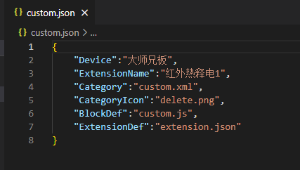

 

custom.json文件为配置自定义扩展的信息:

1.Device：开发板名字

2.ExtensionName：自定义扩展名字

3.Category：积木编辑区左侧菜单的定义

4.CategoryIcon：工具栏图标

5.BlockDef：包含积木样式以及翻译的定义的文件

6.ExtensionDef：扩展名和图片的定义

注：
关于积木的定义同Scratch积木定义，可以参考这两个网站：

1.积木生成器

[积木生成器](https://blockly-demo.appspot.com/static/demos/blockfactory/index.html)

2.积木详细文档

[积木详细文档](https://blockly-demo.appspot.com/static/demos/blockfactory/index.html)
